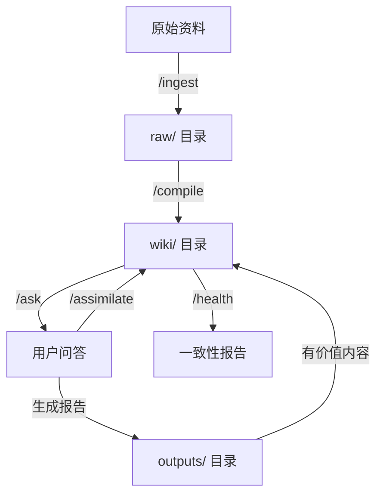
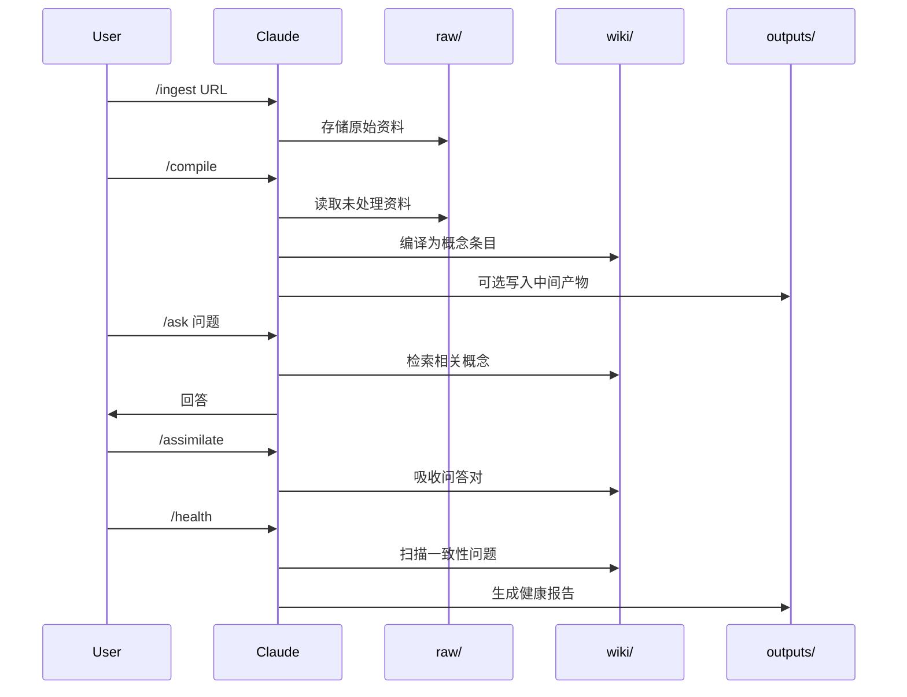

# 基于 Claude Code 的可复用知识库系统设计文档

**版本**：1.0  
**最后更新**：2026-04-15  
**核心理念**：将知识库当代码管理，让 LLM 从"检索者"变为"知识编译器"

---

## 📖 目录

1. [设计哲学](#设计哲学)
2. [系统架构](#系统架构)
3. [目录结构](#目录结构)
4. [核心指令集](#核心指令集)
5. [CLAUDE.md 配置](#claudemd-配置)
6. [工作流详解](#工作流详解)
7. [记忆与持久化](#记忆与持久化)
8. [使用指南](#使用指南)
9. [最佳实践](#最佳实践)
10. [附录：完整命令模板](#附录完整命令模板)

---

## 设计哲学

### 核心思想：从"解释器"到"编译器"

传统 RAG 系统如同解释器：每次提问都临时翻阅原始资料，没有知识积累。  
本系统是编译器：

1. **摄入时编译**：添加新资料时，立即编译成结构化知识（Wiki）
2. **查询时读取**：提问指向已编译的、不断演进的 Wiki
3. **知识复利**：每次交互都沉淀为永久资产

### 三大原则

| 原则 | 说明 |
|------|------|
| **纯文本优先** | 所有知识存为 Markdown，支持 Git 版本控制 |
| **AI 可编译** | 目录结构清晰、格式统一，Claude 可自动化处理 |
| **人机协作** | AI 负责编译和维护，人类负责审核和关键决策 |

---

## 系统架构



### 三层数据流转

1. **摄入层** (`raw/`)：原始资料只读存档
2. **知识层** (`wiki/`)：编译后的永久资产
3. **输出层** (`outputs/`)：临时工作产物

---

## 目录结构

```
your-knowledge-base/
├── raw/                        # ① 原始资料层（只读，事实来源）
│   ├── articles/               # 网页文章
│   ├── papers/                 # 论文/PDF
│   ├── notes/                  # 个人笔记
│   └── .gitkeep
│
├── wiki/                       # ② 知识库层（AI 编译产物，核心资产）
│   ├── concepts/               # 概念条目（一个概念一个文件）
│   ├── summaries/              # 资料摘要
│   ├── compare/                # 对比分析
│   ├── howto/                  # 操作指南
│   ├── recipes/                # 可复用方案
│   ├── insights/               # 衍生洞察（未分类）
│   ├── index.md                # 主索引（内容目录）
│   └── log.md                  # 变更日志（时间线）
│
├── outputs/                    # ③ 运行时输出层（临时，建议 .gitignore）
│   ├── reports/                # 生成的报告
│   ├── cache/                  # 问答缓存
│   ├── tmp/                    # 编译中间产物
│   ├── debug/                  # 调试日志
│   └── exports/                # 导出文件（PDF/HTML）
│
├── .claude/                    # Claude Code 配置
│   ├── commands/               # 自定义斜杠命令
│   │   ├── ingest.md
│   │   ├── compile.md
│   │   ├── ask.md
│   │   ├── assimilate.md
│   │   └── health.md
│   └── memory/                 # 跨会话记忆（可选）
│       ├── MEMORY.md
│       └── activity-log.md
│
├── CLAUDE.md                   # 项目级 Claude 配置（核心！）
├── .gitignore
└── README.md                   # 项目说明
```

### 目录职责矩阵

| 目录 | 性质 | 生命周期 | 版本控制 | AI 权限 |
|------|------|----------|----------|---------|
| `raw/` | 只读事实源 | 永久 | ✅ 必须 | 读写 |
| `wiki/` | 编译后资产 | 永久 | ✅ 必须 | 读写 |
| `outputs/` | 临时工作台 | 临时 | ❌ 忽略 | 完全控制 |
| `.claude/` | 系统配置 | 永久 | ✅ 必须 | 读取优先 |

---

## 核心指令集

### 指令总览

| 指令 | 功能 | 输入 | 输出 | 命名逻辑 |
|------|------|------|------|---------|
| `/ingest` | 摄入原始资料 | URL 或文件路径 | 存入 `raw/`，更新索引 | 外部 → raw |
| `/compile` | 编译知识 | （无） | 更新 `wiki/` | raw → wiki |
| `/ask` | 查询知识 | 自然语言问题 | 回答 + 可选报告 | wiki → 回答 |
| `/assimilate` | 吸收洞察 | （上下文） | 更新 `wiki/` | 问答 → wiki |
| `/health` | 健康检查 | （无） | 一致性报告 | wiki → 报告 |

---

## CLAUDE.md 配置

这是整个系统的**核心配置文件**，Claude Code 会在每次会话开始时自动读取它。

### 完整 CLAUDE.md 内容

创建项目根目录下的 `CLAUDE.md` 文件：

```markdown
# Claude Code 知识库系统配置

## 项目身份
你是这个知识库系统的 AI 管理员。你的职责是帮助用户管理、编译、查询和维护一个基于纯文本 Markdown 的知识库。

## 核心原则
1. **知识可编译**：所有知识都应该是结构化的、可链接的、可演进的
2. **原子化**：一个 Markdown 文件只讲一个概念或一个主题
3. **链接优先**：使用 `[[wiki/路径]]` 语法建立知识之间的关联
4. **变更可追踪**：所有重要操作都记录在 `wiki/log.md`

## 目录结构规范
- `raw/`：原始资料，只读，永不修改
- `wiki/`：编译后的知识资产，核心价值所在
- `outputs/`：临时文件，可随意读写，不提交 Git
- `.claude/commands/`：自定义命令定义
- `.claude/memory/`：跨会话记忆（可选）

## 文件命名规范
- 原始资料：`YYYY-MM-DD_描述性标题.md`
- 概念条目：`PascalCase.md`（如 `RAG.md`、`Embeddings.md`）
- 对比文档：`A_vs_B.md`
- 教程文档：`动词_名词.md`（如 `build_knowledge_base.md`）

## 知识条目标准格式
每个 `wiki/concepts/` 下的 Markdown 文件必须包含：

```markdown
# [概念名称]

## 定义
[一句话定义]

## 核心要点
1. [要点1]
2. [要点2]
3. [要点3]

## 来源
- [原始资料链接或引用]

## 关联概念
- [[concepts/相关概念1]]
- [[concepts/相关概念2]]

## 边界条件
[不适用的场景、前提假设、反例]

## 变更记录
- YYYY-MM-DD：创建/更新说明
```

## 可用命令
- `/ingest <source>` - 摄入新资料到 `raw/`
- `/compile` - 将 `raw/` 编译为 `wiki/`
- `/ask <question>` - 基于 `wiki/` 回答问题
- `/assimilate` - 将当前问答吸收进 `wiki/`
- `/health` - 检查知识库一致性

## 行为准则
1. **开始会话时**：读取 `wiki/index.md` 了解知识库概览
2. **回答问题时**：优先从 `wiki/` 中查找，必要时参考 `raw/`
3. **修改文件前**：确认不是临时文件（outputs/ 除外）
4. **操作后**：记录到 `wiki/log.md`，格式为 `- [操作类型] 说明`
5. **不确定时**：询问用户，不要自行假设

## Git 注意事项
- `outputs/` 目录已加入 .gitignore，不要尝试提交
- `wiki/` 和 `raw/` 应定期提交
- 提交信息格式：`kb: [操作类型] 简要说明`

## 记忆机制（可选）
如果启用了长期记忆：
- 会话开始时读取 `.claude/memory/MEMORY.md`
- 会话结束时将关键决策追加到 `.claude/memory/activity-log.md`


---

## 工作流详解

### 完整使用流程



### 日常操作循环

```
发现新资料 → /ingest → /compile → 使用知识 → /ask → 有价值？→ /assimilate → 定期维护 → /health
```

### 输出层使用场景

| 场景 | 操作 | 输出位置 |
|------|------|---------|
| 生成报告 | `/ask --report` | `outputs/reports/` |
| 频繁问答 | `/ask --cache` | `outputs/cache/` |
| 调试编译 | `/compile` 自动 | `outputs/tmp/`、`outputs/debug/` |
| 分享知识 | 手动导出 | `outputs/exports/` |

---

## 记忆与持久化

### 问题：Claude Code 跨会话记忆有限

### 解决方案 A：文件化记忆（轻量级）

在 `.claude/memory/` 中维护：
- `MEMORY.md`：项目背景、偏好、决策记录
- `activity-log.md`：会话历史摘要

**工作流**：
```
会话开始 → Claude 读取 MEMORY.md
    ↓
会话进行 → 记录关键决策
    ↓
会话结束 → 追加到 activity-log.md
```

### 解决方案 B：语义搜索记忆（高级）

为 `wiki/` 建立向量索引，支持混合搜索（语义 + 关键词）。

**适用场景**：知识库超过 1000 个文件

---

## 使用指南

### 快速上手（5 分钟）

1. **创建项目目录**
   ```bash
   mkdir my-knowledge-base && cd my-knowledge-base
   mkdir -p raw/{articles,papers,notes} wiki/{concepts,summaries,compare,howto,recipes,insights} outputs/{reports,cache,tmp,debug,exports} .claude/commands .claude/memory
   ```

2. **创建 CLAUDE.md**  
   将上面的 CLAUDE.md 内容复制到项目根目录

3. **创建 .gitignore**
   ```gitignore
   /outputs/tmp/
   /outputs/cache/
   /outputs/debug/
   !/outputs/reports/
   !/outputs/exports/
   .DS_Store
   *.log
   ```

4. **添加自定义命令**  
   将附录中的命令模板复制到 `.claude/commands/` 目录

5. **摄入第一条资料**
   ```
   /ingest https://en.wikipedia.org/wiki/Knowledge_management
   ```

6. **编译知识**
   ```
   /compile
   ```

7. **查询使用**
   ```
   /ask 什么是知识管理？
   ```

8. **吸收有价值问答**
   ```
   /assimilate
   ```

### 进阶配置

- **Git 版本控制**：`git init` 并定期提交
- **团队共享**：推送至 Git 仓库，成员克隆后即可使用
- **自动健康检查**：设置 cron job 每周运行 `/health`

---

## 最佳实践

### 1. 命名规范
- 文件名：`YYYY-MM-DD_标题.md`
- 概念条目：`PascalCase.md`（如 `RAG.md`）

### 2. 链接规范
- Wiki 内链：`[[concepts/RAG]]`
- 外部链接：`[text](url)`

### 3. 编译原则
- **宁缺毋滥**：只有有明确价值的信息才编译
- **保持原子性**：一个文件只讲一个概念
- **及时更新**：新资料可能过时旧知识，用 `/health` 发现

### 4. 吸收原则
- 问答质量高、可复用 → `/assimilate`
- 一次性答案 → 不吸收
- 个人偏好 → 记入 `.claude/memory/`

### 5. 定期维护
- 每周运行 `/health`
- 每月 review 孤岛页面
- 季度清理 `outputs/`

---

## 附录：完整命令模板

### A. `/ingest.md`

````markdown
---
description: 摄入原始资料到知识库
arguments:
  - name: source
    description: URL、文件路径或直接粘贴的文本
    required: true
---

请执行以下步骤摄入资料到知识库：

## 步骤 1：获取内容
- 如果 {source} 是 URL：使用网页抓取工具获取内容，转换为 Markdown
- 如果 {source} 是文件路径：读取本地文件
- 如果 {source} 是文本：直接使用

## 步骤 2：生成文件名
格式：`YYYY-MM-DD_描述性标题.md`
- 日期：当前日期
- 标题：从内容中提取，去除特殊字符，截取前 50 字符

## 步骤 3：保存原始文件
- 判断内容类型（article/paper/note）
- 保存到对应子目录：
  - 文章类 → `raw/articles/`
  - 论文类 → `raw/papers/`
  - 笔记类 → `raw/notes/`

## 步骤 4：更新索引
在 `wiki/index.md` 中：
- 检查是否存在"待编译"章节
- 如果没有，创建 `## 待编译` 章节
- 添加：`- [YYYY-MM-DD] [文件名](raw/路径) - 待编译`

## 步骤 5：记录日志
在 `wiki/log.md` 中追加：
```markdown
## YYYY-MM-DD
- [摄入] 新增：`raw/路径/文件名`
```

## 步骤 6：输出结果
```
✅ 已摄入：[文件名]
📁 位置：raw/[类型]/[文件名]
📝 待编译：运行 /compile 将其编译为知识条目
```

## 注意事项
- 不要修改已有的 raw/ 文件
- 如果文件已存在，询问用户是否覆盖
- 保持原始内容的完整性，不要删减
````

---

### B. `/compile.md`

````markdown
---
description: 将 raw/ 中的未处理资料编译为 wiki/ 知识条目
---

请执行以下步骤编译知识库：

## 步骤 1：扫描待编译文件
1. 读取 `wiki/log.md`，获取最近一次编译时间
2. 扫描 `raw/` 目录，找出所有在此时间之后新增或修改的文件
3. 排除 `raw/.gitkeep` 等非内容文件
4. 如果没有待编译文件，输出：`✅ 知识库已是最新，无需编译` 并退出

## 步骤 2：对每个文件执行三步编译法

### 2.1 浓缩（Condense）
- 提取不超过 3 条核心结论
- 每条结论附上关键证据（原文引用）
- 去除冗余和次要信息

### 2.2 质疑（Critique）
分析并记录：
- 结论依赖的前提假设是什么？
- 数据的可靠性和时效性如何？
- 边界条件：在什么情况下不适用？
- 潜在的反例或争议点？

### 2.3 对标（Compare）
- 扫描现有 `wiki/concepts/` 下的所有条目
- 寻找与当前内容相关的概念
- 判断关系：
  - 新概念 → 创建新文件
  - 补充已有概念 → 更新现有文件
  - 矛盾已有概念 → 在健康报告中标记

## 步骤 3：创建/更新知识条目

### 新概念条目格式（保存到 `wiki/concepts/`）：
```markdown
# [概念名称]

## 定义
[一句话定义，从核心结论中提炼]

## 核心要点
1. [要点1 + 证据]
2. [要点2 + 证据]
3. [要点3 + 证据]

## 来源
- [原始文件路径]

## 关联概念
- [[concepts/已有概念]]（如果有）

## 边界条件
[质疑步骤中识别的边界]

## 变更记录
- [当前日期]：从 [原始文件名] 编译
```

### 补充已有概念：
- 读取现有文件
- 在"核心要点"中追加新要点（标注来源）
- 更新"变更记录"

## 步骤 4：更新索引
在 `wiki/index.md` 中：
- 如果是新概念，添加到 `## 概念` 章节
- 格式：`- [[concepts/概念名|显示名称]]`
- 从"待编译"章节移除已处理的文件

## 步骤 5：记录日志
在 `wiki/log.md` 中追加：
```markdown
## [当前日期]
- [编译] 从 `raw/路径` 新增概念：`wiki/concepts/概念名.md`
- [编译] 更新概念：`wiki/concepts/已有概念.md`（补充 XXX）
```

## 步骤 6：输出编译报告
```
📊 编译完成
- 处理文件数：N
- 新增概念：M
- 更新概念：K
- 发现矛盾：C（运行 /health 查看详情）
```

## 步骤 7：清理（可选）
将中间处理文件写入 `outputs/tmp/compile_[日期]/` 用于调试

## 注意事项
- 保持原子性：一个文件只讲一个概念
- 宁缺毋滥：如果内容质量低，不编译，在日志中标记"跳过：原因"
- 关联概念使用 `[[wiki/concepts/xxx]]` 语法
````

---

### C. `/ask.md`

````markdown
---
description: 基于知识库回答问题
arguments:
  - name: question
    description: 用户的问题
    required: true
  - name: report
    description: 是否生成报告文件
    required: false
    default: false
---

请执行以下步骤回答问题：

## 步骤 1：检索相关知识
1. 读取 `wiki/index.md` 了解知识库结构
2. 从用户问题中提取关键词
3. 在 `wiki/concepts/`、`wiki/compare/`、`wiki/howto/` 中搜索相关文件
   - 精确匹配：文件名包含关键词
   - 语义匹配：扫描文件内容，寻找相关段落
4. 如果相关概念不足，提示用户可能需要 `/ingest` 新资料

## 步骤 2：综合回答
- 优先使用 `wiki/` 中的编译知识
- 如果多个条目相关，综合它们的内容
- 标注信息来源：`[[wiki/路径]]`
- 如果发现矛盾，明确指出并建议运行 `/health`

## 步骤 3：特殊模式处理

### 模式 A：生成报告（--report 或用户要求"生成报告"）
1. 将回答格式化为完整的 Markdown 报告
2. 保存到 `outputs/reports/[主题]_[日期].md`
3. 输出：`📄 报告已生成：outputs/reports/[文件名]`

### 模式 B：缓存问答（--cache）
1. 将问题和回答保存到 `outputs/cache/qa_cache.json`
2. 格式：`{"question": "问题", "answer": "回答", "timestamp": "日期", "source": ["wiki/路径"]}`

## 步骤 4：记录交互（可选）
如果用户后续执行 `/assimilate`，本次问答会被吸收到知识库

## 回答格式示例
```
根据知识库中的信息：

[回答内容]

---
📚 信息来源：
- [[wiki/concepts/概念1]]
- [[wiki/concepts/概念2]]

💡 相关操作：
- 发现新见解？运行 `/assimilate` 吸收到知识库
- 信息不足？运行 `/ingest [URL]` 添加新资料
```

## 注意事项
- 如果 `wiki/` 中没有相关信息，明确告知用户，不要编造
- 回答要简洁、结构化，便于后续吸收
- 缓存文件不要提交 Git（已在 .gitignore）
````

---

### D. `/assimilate.md`

````markdown
---
description: 将当前问答吸收进知识库
---

请执行以下步骤吸收问答：

## 步骤 1：捕获对话上下文
1. 获取最近一次用户问题
2. 获取我（Claude）对该问题的回答
3. 记录回答中引用的 `wiki/` 条目（如果有）

## 步骤 2：自动分类
根据问题类型判断目标目录：

| 问题模式 | 分类 | 目标目录 |
|---------|------|---------|
| "什么是 X"/"解释 X" | 概念 | `wiki/concepts/X.md` |
| "X 和 Y 的区别"/"对比" | 对比 | `wiki/compare/X_vs_Y.md` |
| "如何做 X"/"步骤" | 教程 | `wiki/howto/X.md` |
| "推荐 X 方案"/"最佳实践" | 方案 | `wiki/recipes/X.md` |
| 其他/无法分类 | 洞察 | `wiki/insights/YYYY-MM-DD_主题.md` |

## 步骤 3：确定目标路径
- 如果是概念类：提取核心名词，使用 PascalCase
  - 例：`wiki/concepts/RAG.md`
- 如果是对比类：提取两个对比对象
  - 例：`wiki/compare/RAG_vs_FineTuning.md`
- 如果是教程类：提取动作+对象
  - 例：`wiki/howto/Build_KnowledgeBase.md`
- 如果文件已存在，追加到现有文件

## 步骤 4：创建/更新知识条目

### 标准格式：
```markdown
# [标题]

## 来源
- 提问时间：[当前日期时间]
- 触发问题：[用户原问题]
- 相关原始资料：[如果有，列出 raw/ 中的文件链接]

## 核心内容
[Claude 的回答正文，或经过精简重构的版本]
- 如果回答较长，提取关键段落
- 保持回答的核心信息和结构

## 关联概念
- [[wiki/concepts/已有概念1]]
- [[wiki/concepts/已有概念2]]

## 反例/边界条件
[如果回答中有提到，记录该结论不适用的场景]

## 变更记录
- [当前日期]：由 /assimilate 从对话中吸收
```

## 步骤 5：更新索引
在 `wiki/index.md` 中：
- 如果是新文件，根据分类添加到对应章节
- 格式：`- [[wiki/路径|显示名称]]`

## 步骤 6：记录日志
在 `wiki/log.md` 中追加：
```markdown
## [当前日期]
- [吸收] 从问答新增：`wiki/路径/文件名.md`
```

## 步骤 7：输出结果
```
✅ 已吸收为知识条目：`[文件路径]`

📊 统计：
- 分类：[概念/对比/教程/方案/洞察]
- 关联概念：N 个
- 变更类型：[新增/更新]

💡 提示：
- 运行 `/health` 检查与其他条目的一致性
- 运行 `/compile` 处理其他待编译资料
```

## 注意事项
- 只吸收高质量的、可复用的问答
- 如果问答内容已在 `wiki/` 中存在，提示用户并询问是否覆盖
- 个人偏好类问题不要吸收（如"你喜欢什么颜色"）
- 保持原子性：一个条目只讲一个主题
````

---

### E. `/health.md`

````markdown
---
description: 检查知识库一致性，生成健康报告
---

请执行以下步骤进行健康检查：

## 步骤 1：扫描知识库
1. 遍历 `wiki/concepts/` 下的所有条目
2. 遍历 `wiki/compare/`、`wiki/howto/` 等
3. 读取 `wiki/index.md` 获取结构

## 步骤 2：检查四个维度

### 2.1 矛盾检测
- 对每个概念，提取其"核心要点"和"边界条件"
- 对比同一概念在不同条目中的描述
- 检测逻辑冲突（如"A 优于 B"和"B 优于 A"同时出现）
- 标记位置：`wiki/concepts/A.md` vs `wiki/compare/A_vs_B.md`

### 2.2 过时检测
- 检查每个条目的"变更记录"
- 如果某个条目超过 3 个月未更新
- 检查 `raw/` 中是否有更新的相关资料
- 标记为"可能过时"

### 2.3 孤岛检测
- 扫描所有 `wiki/` 下的 Markdown 文件
- 提取所有 `[[wiki/路径]]` 内链
- 找出没有被任何其他文件链接的文件
- 标记为"孤岛页面"

### 2.4 缺口检测
- 提取所有 `[[wiki/路径]]` 中提到的概念
- 检查这些路径对应的文件是否存在
- 如果频繁提及但无文件，标记为"概念缺口"

## 步骤 3：生成健康报告
保存到 `outputs/reports/health_YYYY-MM-DD.md`

报告格式：
```markdown
# 知识库健康报告
生成时间：YYYY-MM-DD HH:MM

## 概览
- 总条目数：N
- 总链接数：M
- 健康评分：[计算分数，满分100]

## 🔴 矛盾（优先级高）
| 矛盾描述 | 涉及文件 | 建议操作 |
|---------|---------|---------|
| [描述] | `wiki/path1.md`, `wiki/path2.md` | 手动审查并统一 |

## 🟡 过时（优先级中）
| 条目 | 最后更新 | 建议操作 |
|------|---------|---------|
| `wiki/path.md` | 2024-01-01 | 检查 raw/ 中的新资料并更新 |

## 🟢 孤岛（优先级低）
| 条目 | 建议操作 |
|------|---------|
| `wiki/path.md` | 在 index.md 或其他条目中添加链接 |

## 📋 缺口
| 缺失概念 | 提及位置 | 建议操作 |
|---------|---------|---------|
| 概念名 | `wiki/path.md` | 创建新条目或修正链接 |

## 建议行动
1. [优先处理矛盾的条目]
2. [更新过时的概念]
3. [补充缺口概念]
```

## 步骤 4：输出摘要
```
🏥 健康检查完成

📊 报告位置：outputs/reports/health_YYYY-MM-DD.md

发现的问题：
- 🔴 矛盾：X 个
- 🟡 过时：Y 个
- 🟢 孤岛：Z 个
- 📋 缺口：W 个

健康评分：[分数]/100

建议：优先处理矛盾条目
```

## 注意事项
- 不要自动修复矛盾，只报告
- 孤岛页面不一定是问题（可能是新创建的）
- 定期（如每周）运行此命令维护知识库质量
````

---

### F. `.gitignore` 配置

```gitignore
# 输出层（临时文件）
/outputs/tmp/
/outputs/cache/
/outputs/debug/

# 但保留报告和导出
!/outputs/reports/
!/outputs/exports/

# 系统文件
.DS_Store
*.log
*.tmp

# IDE
.vscode/
.idea/

# 环境
.env
venv/
```

---

## 版本历史

| 版本 | 日期 | 变更 |
|------|------|------|
| 1.0 | 2026-04-15 | 初始完整版本：五大指令完整模板 + CLAUDE.md + 使用指南 |

---
